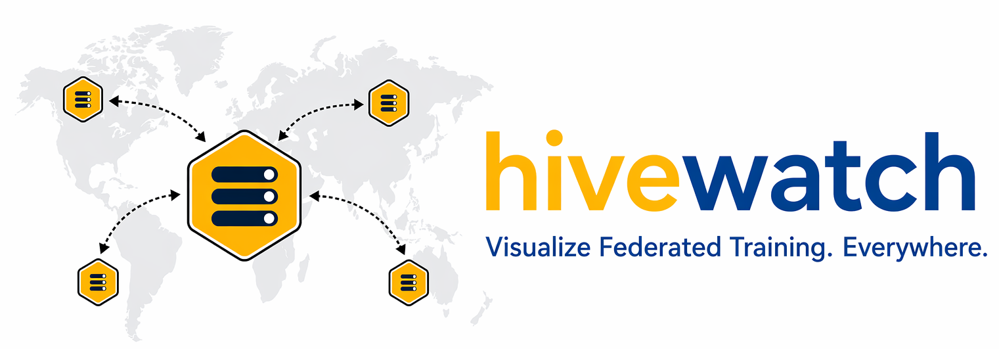

# HiveWatch

<p align="center"></p>

`hivewatch` is a framework-agnostic monitoring toolkit for federated and distributed machine learning workloads. It provides a consistent interface for logging client updates, round summaries, and map-ready metadata across local experiments and larger deployments.

## Installation

`hivewatch` requires Python 3.8 or later.

```bash
pip install -e .                 # core package
pip install -e ".[wandb]"        # Weights & Biases integration
pip install -e ".[mlflow]"       # MLflow integration
pip install -e ".[wandb,mlflow]" # both integrations
pip install -e ".[all]"          # all optional dependencies
```

## Quickstart

```python
import hivewatch
from hivewatch.emitters import WandbEmitter

hivewatch.init(
    algorithm="FedAvg",
    emitters=[WandbEmitter(project="my-fl-project")],
)

for round_num in range(num_rounds):
    hivewatch.round_start(round_num)

    for client_id, metadata in client_results.items():
        hivewatch.log_client_update(
            client_id=client_id,
            round=round_num,
            **metadata,
        )

    hivewatch.log_round(
        round=round_num,
        global_accuracy=agg_accuracy,
        global_loss=agg_loss,
    )

hivewatch.finish()
```

## Emitters

`hivewatch` uses a pluggable emitter model. Create one or more emitters and pass them to `hivewatch.init()` to send the same run data to multiple destinations.

### Local map and deferred map metadata

```python
from hivewatch.emitters import SSEEmitter

hivewatch.init(
    algorithm="FedAvg",
    emitters=[SSEEmitter(port=7070, serve_map=False)],
)
```

`SSEEmitter` persists both of the following artifacts:

- `runs/<run_id>.jsonl` for the complete event history
- `runs/<run_id>.map.json` for map-ready metadata that can be loaded directly later

Serve the dashboard separately:

```bash
hivewatch map run --runs-dir runs --port 7070
```

Open one specific saved run in static mode:

```bash
hivewatch map run --runs-dir runs --run-id run-abc123
```

The bundled `examples/hivewatch_map.html` viewer loads map metadata first and falls back to the JSONL-derived event history for older runs. This keeps local development and later replay workflows compatible with the same viewer.

### Package layout

The source tree groups related functionality into focused areas:

- `src/hivewatch/map/`
  - `metadata.py` for map metadata assembly and event-to-round transformations
  - `server.py` for the local map/dashboard HTTP server
- `src/hivewatch/geo/`
  - `utils.py` for client-side location resolution helpers

This keeps map-related files together and avoids requiring users to maintain
example-local geo helper files or server-side peer inspection patches.

### Weights & Biases

```python
from hivewatch.emitters import WandbEmitter

hivewatch.init(
    algorithm="FedAvg",
    emitters=[WandbEmitter(project="my-fl-project")],
)
```

### MLflow

```python
from hivewatch.emitters import MLflowEmitter

# Local tracking directory (MLflow default)
hivewatch.init(emitters=[MLflowEmitter(experiment="my-fl-project")])

# Remote tracking server
hivewatch.init(emitters=[MLflowEmitter(
    tracking_uri="http://localhost:5000",
    experiment="my-fl-project",
)])

# MLflow system metrics
hivewatch.init(emitters=[MLflowEmitter(
    experiment="my-fl-project",
    mlflow_system_metrics=True,
    system_metrics_sampling_interval=5,
)])
```

Start an MLflow server:

```bash
mlflow server --host 0.0.0.0 --port 5000
```

To use a custom storage directory:

```bash
mlflow server \
  --host 0.0.0.0 \
  --port 5000 \
  --backend-store-uri ./my_custom_dir \
  --default-artifact-root ./my_custom_dir/artifacts
```

The MLflow UI is then available at `http://localhost:5000`.

### Multiple emitters

```python
from hivewatch.emitters import MLflowEmitter, WandbEmitter

hivewatch.init(
    algorithm="FedAvg",
    emitters=[
        WandbEmitter(project="my-fl-project"),
        MLflowEmitter(experiment="my-fl-project"),
    ],
)
```

### Custom emitters

```python
class MyEmitter:
    def on_init(self, run_id, algorithm, config): ...
    def on_round(self, summary, clients): ...
    def on_client_update(self, client): ...
    def finish(self): ...

hivewatch.init(emitters=[MyEmitter()])
```

## Metadata Contract

`hivewatch` defines the keys it understands, but it preserves unknown keys so applications can attach additional metadata without losing information.

| Field | Type | Description |
|---|---|---|
| `client_id` | str | Client identifier |
| `round` | int | Current global round |
| `local_accuracy` | float | Accuracy after local training |
| `local_loss` | float | Loss after local training |
| `num_samples` | int | Local dataset size |
| `gradient_norm` | float | L2 norm of local gradients |
| `bytes_sent` | int | Bytes uploaded to the server |
| `train_time_sec` | float | Local training wall-clock time |
| `cpu_pct` | float | CPU utilization percentage |
| `ram_mb` | float | Memory usage in MB |
| `gpu_util_pct` | float | GPU utilization percentage |
| `lat` / `lng` / `country` | float/str | Client location metadata for map visualization |
| `base_round` | int | For asynchronous FL, staleness is `round - base_round` |

## Logged Metrics

### Weights & Biases

| Metric | Description |
|---|---|
| `round/accuracy`, `round/loss` | Global model performance per round |
| `round/participation_rate` | Completed clients divided by selected clients |
| `round/num_stragglers` | Number of stragglers |
| `round/duration_sec` | Wall-clock time per round |
| `comm/total_bytes_mb` | Total upload and download volume |
| `comm/bytes_per_client_mb` | Per-client communication cost |
| `agg/gradient_divergence` | Standard deviation of per-client gradient norms |
| `agg/aggregation_time_sec` | Server-side aggregation time |
| `client/<id>/accuracy` | Per-client accuracy |
| `client/<id>/gradient_norm` | Per-client gradient norm |
| `client/<id>/staleness` | Rounds behind the current global model in async FL |
| `client/<id>/bytes_sent_mb` | Per-client upload size |
| `client/<id>/train_time_sec` | Per-client training time |
| `sys/<id>/cpu_pct` | Per-client CPU utilization |
| `sys/<id>/ram_mb` | Per-client RAM usage |
| `event/client_dropout` | Dropout counter |
| `event/comm_failure` | Communication failure counter |

All metrics use `round` as the x-axis through `wandb.define_metric()`.

### MLflow

MLflow records the same metrics. Per-client metrics use dot notation such as `client.<id>.accuracy` instead of slash notation because of MLflow metric naming conventions. Hyperparameters are logged once as MLflow parameters, and model checkpoints are stored as versioned MLflow artifacts.

## Architecture

```text
FL Clients
  └── return metadata dict
        │  (gRPC / HTTP / sockets / others; hivewatch does not depend on the transport layer)
        ▼
FL Server
  └── receives metadata and calls hivewatch:
        hivewatch.round_start(round)
        hivewatch.log_client_update(client_id, round, **metadata)
        hivewatch.log_round(round, global_accuracy, global_loss)
        │
        ▼
hivewatch
  ├── WandbEmitter  →  wandb.ai dashboard
  └── MLflowEmitter →  MLflow UI (localhost:5000)
```

`hivewatch` does not depend on a specific transport layer or FL framework. Applications bridge their training framework to `hivewatch` in the same way they would bridge it to another experiment tracking backend.

For map visualization, the storage contract includes a standalone metadata artifact in addition to the raw event log. This supports:

- local CLI runs that immediately launch or serve a map
- local or remote services that persist metadata for later display
- future deployments that store metadata in object storage and load it in a separate web tier
